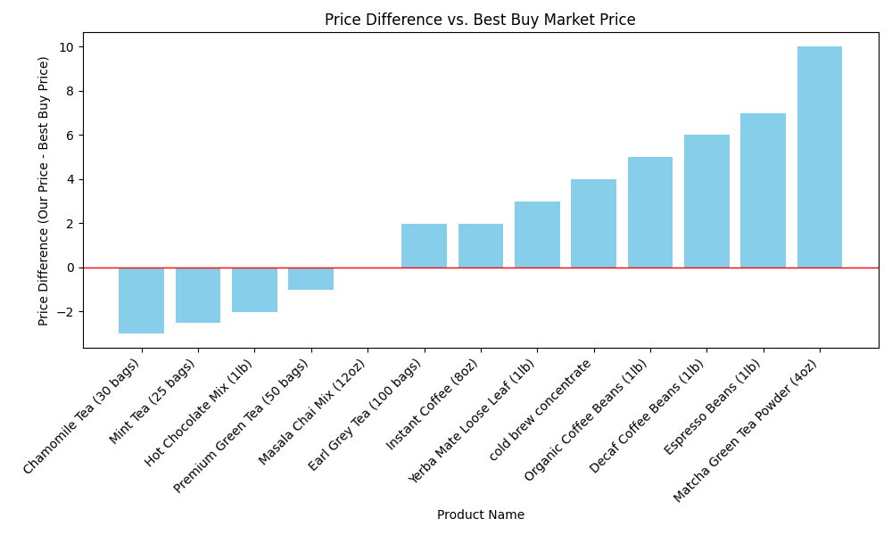

# Data Quality Issues
- Missing columns: ['expiration_date', 'brand']
- Extra columns: ['expiry_date', 'supplier']

## Cleaned Data Summary
```
                      product_name  our_price   category  current_stock  restock_threshold expiry_date          supplier  bestbuy_market_price  price_diff price_recommendation
count                           14  13.000000         14      14.000000          13.000000          14                14                  14.0   13.000000                   14
unique                          14        NaN          3            NaN                NaN          14                 6                   NaN         NaN                    4
top     Organic Coffee Beans (1lb)        NaN  Beverages            NaN                NaN  2024-11-15  Tea Time Imports                   NaN         NaN           Overpriced
freq                             1        NaN         12            NaN                NaN           1                 6                   NaN         NaN                    8
mean                           NaN  12.336154        NaN      22.071429          18.615385         NaN               NaN                  10.0    2.336154                  NaN
std                            NaN   3.996794        NaN      14.317629           5.694127         NaN               NaN                   0.0    3.996794                  NaN
min                            NaN   6.990000        NaN       0.000000          10.000000         NaN               NaN                  10.0   -3.010000                  NaN
25%                            NaN   8.990000        NaN      12.750000          15.000000         NaN               NaN                  10.0   -1.010000                  NaN
50%                            NaN  11.990000        NaN      20.500000          20.000000         NaN               NaN                  10.0    1.990000                  NaN
75%                            NaN  14.990000        NaN      29.500000          20.000000         NaN               NaN                  10.0    4.990000                  NaN
max                            NaN  19.990000        NaN      50.000000          30.000000         NaN               NaN                  10.0    9.990000                  NaN
```

## External Data Integration (Best Buy)
Approximate market prices from Best Buy for each category:

- **Beverages**: $10.00
- **Tea**: $10.00
- **Coffee**: $10.00

## Insights
- Overpriced items: 8
- Underpriced items: 4
- At Market: 1

### Product-Level Recommendations
- **Organic Coffee Beans (1lb)** (Beverages): Overpriced
- **Premium Green Tea (50 bags)** (Beverages): Underpriced
- **Masala Chai Mix (12oz)** (Beverages): At Market
- **Yerba Mate Loose Leaf (1lb)** (Beverages): Overpriced
- **Hot Chocolate Mix (1lb)** (Beverages): Underpriced
- **Earl Grey Tea (100 bags)** (Beverages): Overpriced
- **Espresso Beans (1lb)** (Beverages): Overpriced
- **Chamomile Tea (30 bags)** (Tea): Underpriced
- **Matcha Green Tea Powder (4oz)** (Beverages): Overpriced
- **Decaf Coffee Beans (1lb)** (Beverages): Overpriced
- **Mint Tea (25 bags)** (Beverages): Underpriced
- **Instant Coffee (8oz)** (Coffee): Overpriced
- **Rooibos Tea (40 bags)** (Beverages): No Data
- **cold brew concentrate** (Beverages): Overpriced

## Visualization
Price difference bar chart:




## Future Recommendations
- Investigate significant price gaps.
- Use more specific queries for better Best Buy matching.
- Expand visualizations (e.g., categories, time series).
